# Caretaker Android App

In the realm of modern living, where time is of the essence and responsibilities abound, caretaking often becomes a challenging task. In response to this societal need, the development of mobile applications tailored for caretaking has gained momentum. This abstract highlights the essence of such an application designed to streamline and enhance the caretaking experience. This caretaker app offers a comprehensive platform that facilitates efficient management of tasks related to caregiving. This app provides reliable caretakers to all those who need help, through intuitive interfaces and customizable features with healthcare. Additionally, the app incorporates reminders, ensuring timely adherence to caregiving duties.

## Pages Description

1. **PreLogin Activity**
   - **Description**: Entry point to the application where users choose to log in as a client or volunteer.
   - **Functionality**:
     - Users can navigate to ClientLogin or VolunteerLogin activities based on their role selection.
     - Uses Firebase authentication for user login and registration.
   - **Screenshot**:
     - 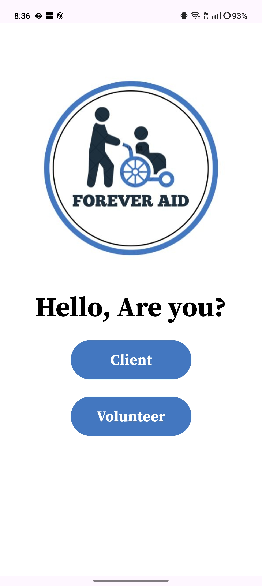

2. **ClientLogin Activity**
   - **Description**: Handles client authentication and login.
   - **Functionality**:
     - Clients input credentials to log in or can register for new accounts.
     - Integrates with Firebase authentication.
   - **Screenshot**:
     - 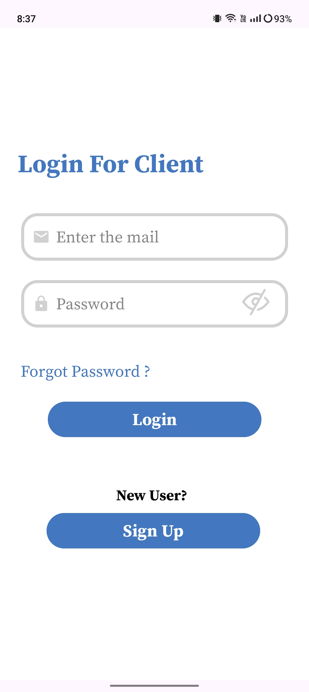

3. **VolunteerLogin Activity**
   - **Description**: Manages volunteer authentication and login.
   - **Functionality**:
     - Volunteers input credentials to log in or can register for new accounts.
     - Integrates with Firebase authentication.
   - **Screenshot**:
     - 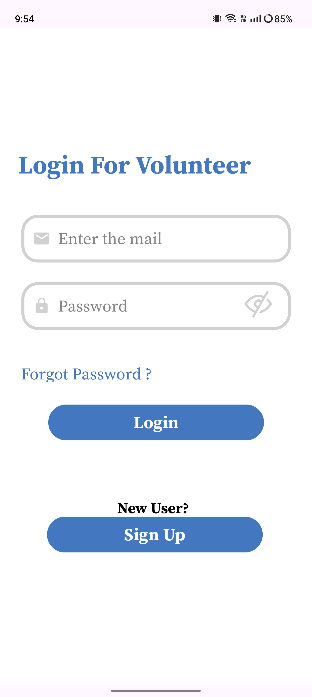

4. **MainActivity**
   - **Description**: Main activity post-login, directs users based on their role (client or volunteer).
   - **Functionality**:
     - Redirects clients to ClientMainActivity and volunteers to VolunteerMainActivity.
     - Utilizes Firestore for data retrieval and display.
   - **Screenshot**:
     - 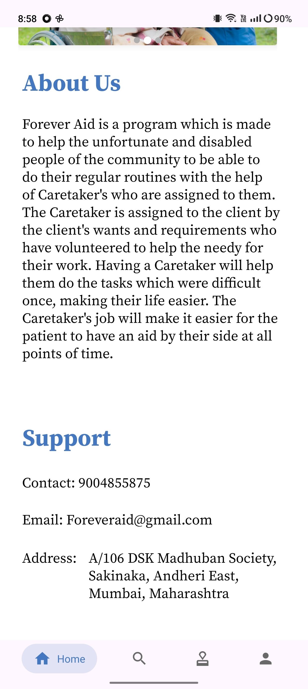

## Fragments

- **ClientFragment**
  - **Description**: Fragment displaying client-specific information and tasks.
  - **Functionality**:
    - Integrated within ClientMainActivity for modular UI management.
    - Uses RecyclerView and Firestore adapters for data display.
  - **Screenshot**:
  1. **Home**
     - 
  2. **Application**
     - 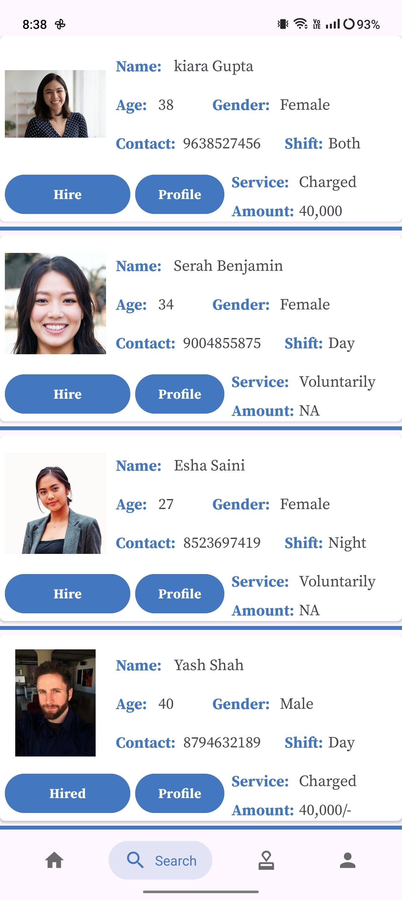
  3. **Notification**
     - 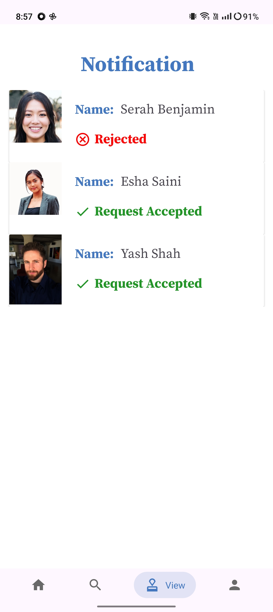
  4. **Profile**
     - 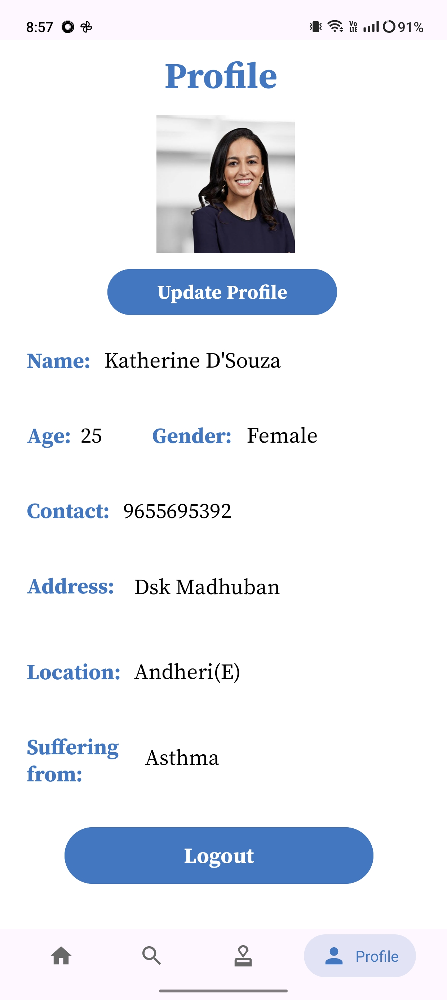
  5. **Update Profile**
     - 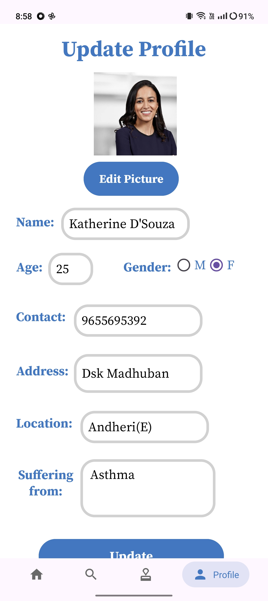
     
- **VolunteerFragment**
  - **Description**: Fragment displaying volunteer-specific tasks and interactions.
  - **Functionality**:
    - Part of VolunteerMainActivity for managing volunteer tasks and information.
    - Communicates with Firestore for real-time updates and task management.
- **Screenshots**:
  1. **Home**
     - 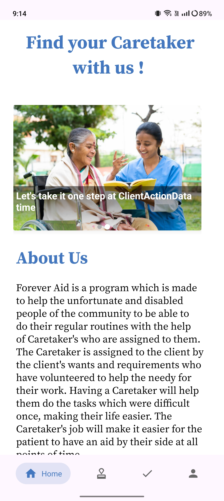
  2. **Applications**
     - 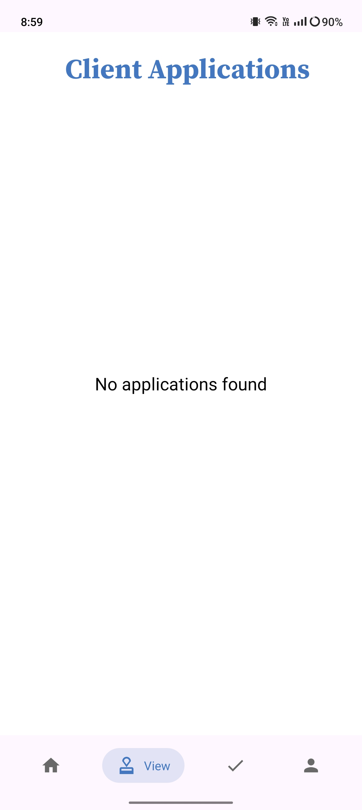
  2. **Notification**
     - 
  3. **Profile**
      - 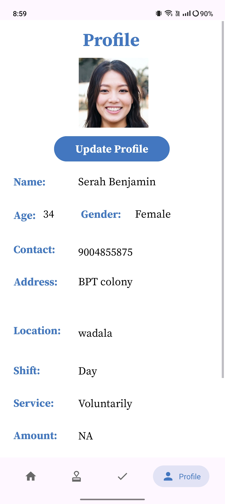
  4. **Update Profile**
      - 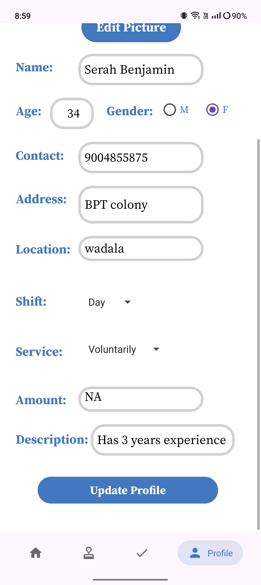

## Setup and Run Instructions

To run this project locally on your machine, follow these steps:

1. **Clone the Repository**:
   ```
   git clone https://github.com/your/repository.git
   ```
2. **Open in Android Studio**:
  - Launch Android Studio.
  - Choose "Open an existing Android Studio project".
  - Navigate to the cloned repository and select the project directory.

3. **Configure Firebase**:
  - Create a Firebase project at Firebase Console.
  - Add your Android app to the Firebase project (follow Firebase documentation).
  - Download the google-services.json file and place it in the app/ directory of your project.

4. **Run the App**:
  - Connect an Android device or use an emulator.
  - Click on the "Run" button in Android Studio to build and install the app on your device/emulator.

5. **Testing**:
  - Verify Firebase authentication and Firestore integration.
  - Ensure correct functionality of activities and fragments.
  - Test dynamic data display and interaction features.

## Additional Notes
  - Dependencies: Ensure all dependencies listed in build.gradle files are correctly resolved.
  - Troubleshooting: Refer to Android Studio logs and Firebase console for error messages during setup and testing.
